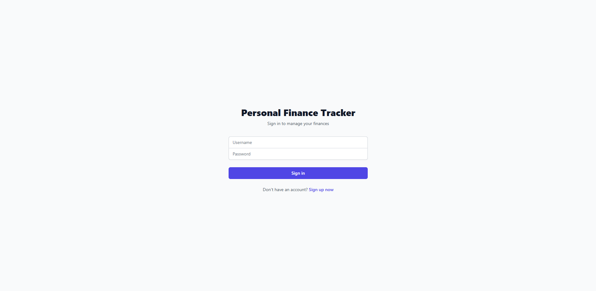
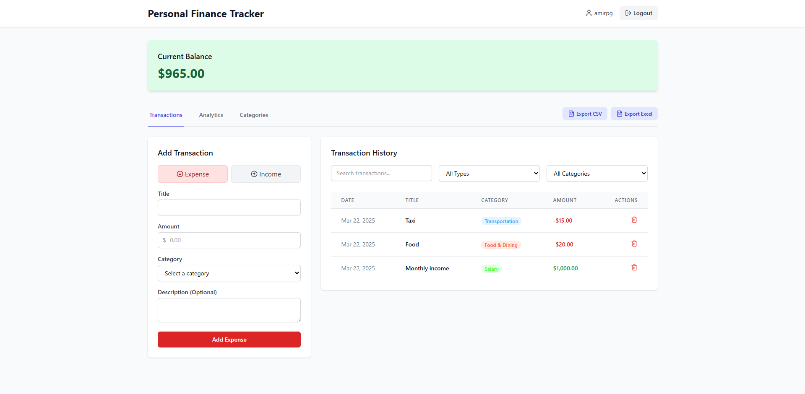

# Personal Finance Tracker

A modern personal finance tracking application built entirely with AI assistance using Cursor IDE and large language models (LLMs).

## 🤖 About the Development

This project is unique because it was developed **entirely through collaboration with AI**:

- Built using [Cursor](https://cursor.sh/) - an AI-first code editor
- All code was written, debugged, and optimized with the assistance of LLMs
- Zero manual coding - all implementation decisions and solutions were AI-driven

## 🚀 Features

- Track income and expenses
- Categorize transactions
- Visualize spending patterns with interactive charts
- Set and monitor budget goals
- Secure user authentication
- Responsive design for all devices

## 💻 Tech Stack

### Frontend
- React.js
- Material UI components
- Tailwind CSS for styling
- Chart visualization using MUI X-Charts

### Backend
- Node.js API server
- Express.js framework
- MongoDB database
- JWT authentication

## 🏁 Getting Started

### Prerequisites
- Node.js (v14.x or higher)
- npm or yarn package manager
- MongoDB (local or Atlas connection)

### Installation

1. Clone the repository
```bash
git clone https://github.com/yourusername/personal-finance-tracker.git
cd personal-finance-tracker
```

2. Install backend dependencies
```bash
cd backend
npm install
```

3. Install frontend dependencies
```bash
cd ../frontend
npm install
```

4. Start the development servers

Backend:
```bash
cd backend
npm run dev
```

Frontend:
```bash
cd frontend
npm start
```

5. Open your browser and navigate to `http://localhost:3000`

## 📝 Project Structure

```
personal-finance-tracker/
├── backend/             # Node.js API server
│   ├── controllers/     # Request handlers
│   ├── models/          # Data models
│   ├── routes/          # API routes
│   └── server.js        # Entry point
├── frontend/            # React application
│   ├── public/          # Static files
│   └── src/             # React components and logic
│       ├── components/  # Reusable UI components
│       ├── pages/       # Application pages
│       └── utils/       # Helper functions
└── README.md            # Project documentation
```

## 🤝 Contributing

Contributions, issues, and feature requests are welcome! Feel free to check the [issues page](https://github.com/yourusername/personal-finance-tracker/issues).

## 📸 Screenshots

### Login Screen


### Dashboard


## 🔮 Future Enhancements

- Mobile applications (React Native)
- Recurring transaction management
- Data export capabilities
- Financial goal tracking
- Investment portfolio tracking

---

**Note:** This entire application, including this README, was created with the assistance of AI through Cursor IDE. No manual coding was performed, demonstrating the power of AI-assisted development. 